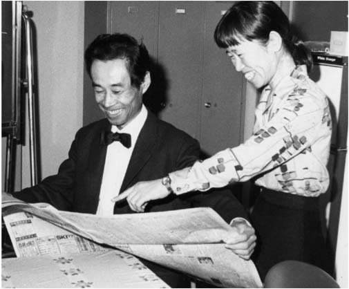
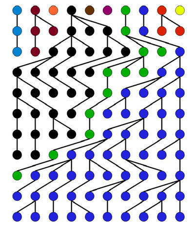
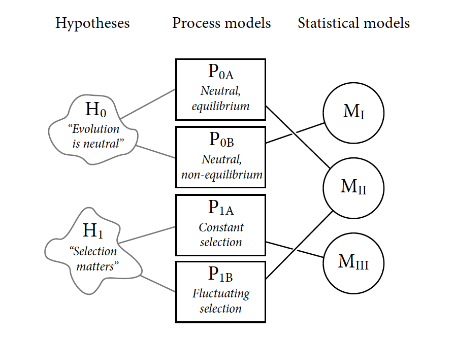

# What we (the [Valenzano Lab](http://valenzano-lab.age.mpg.de/)) work on

--


.footnote[
[1] [Cui R et al., Cell, 2019](https://pubmed.ncbi.nlm.nih.gov/31257025/)
]
---

# What we (the [Valenzano Lab](http://valenzano-lab.age.mpg.de/)) work on

--

Life history trait evolution in **African killifishes**;

--

- evolution of **annual**/non-annual life cycles;

--

Evolution of male sexual coloration, genome size, mutation rate;

--

Evolutionary immunology:

--

- evolution of the IgH and TCR locus across African killifishes;

--

Biology of Aging:

--

- age-dependent decline in all physiological functions (e.g. reproduction, immunity, learning, memory, etc.);

--

- theoretical aspects of how disease-determining variants emerge in populations; 

--

Microbiome ecology and evolution in the context of organism health and aging;

---

class: inverse, center, middle

# [Valenzano Lab (pic from 2019)](http://valenzano-lab.age.mpg.de/)


---

# My goals for today

--

1. To recap and re-derive some key concepts about neutral and nearly neutral theory of molecular evolution (including the controversies);

--

2. To present you the important case of fitness in the context of age-structured populations;

--

3. To connect our understanding of how "(slightly) deleterious mutations accumulate in finite populations" with the theory of the evolution of aging and lifespan across species (with Martin Bagic!);

---

class: inverse, center, middle

# Let's get started

---

class: inverse, center, middle

# Recap of basic concepts in the **neutral model** of molecular evolution



---

# Wright-Fisher model of population genetics 

## Fundamental Assumptions:

--

- N diploid individuals;

--

- An infinite gamete pool;

--

- Each individual contributes equally and synchronously to the gamete pool;

--

- Pairs of gametes are drawn randomly from the pool at each generation;

--

- Non-overlapping generations;

---

# Random Genetic Drift at a Neutral Locus


.pull-left[

The probability of $A'$ to emerge in a population at a given time in a locus is:  

$p_{0} = \frac{1}{2N}$

> N is the number of diploid individuals;

The probability that $A'$ will **not** be incorporated in the next generation is:  

$p^{'}_{1}= (1 - p_{0})^{2N}$

With large N (e.g., more than 10 individuals):  

$p^{'}_{1} = e^{-1}$ 

]

.pull-right[


]

---

class: inverse 

# Rate of _instant change_ in the frequency of new neutral mutations

--

$p^{'}_{1} = (1 - \frac{1}{2N})^{2N}$

--

$lim_{x \to \infty}(1 - \frac{1}{x})^{x} = ?$

--

Let's rewrite  
$(1 - \frac{1}{x})^{x}$ as $e^{ln(1 - \frac{1}{x})^{x}}$

--

Let's investigate the lim of the exponent, $ln(1 - \frac{1}{x})^{x}$ :

$lim_{x \to \infty}(ln(1 - \frac{1}{x})^{x})$

--

It's convenient to re-write  
$ln(1 - \frac{1}{x})^{x}$  as  $ln(\frac{x - 1}{x})^{x}$

--

$ln(\frac{x - 1}{x})^{x} = x \cdot ln(\frac{x - 1}{x})$

---

class: inverse 

The $lim_{x \to \infty}(x \cdot ln(\frac{x-1}{x}))$ poses a problem 

--

as $x \rightarrow \infty$  

--

we have somethings like $\infty \cdot ln(1) = \infty \cdot 0$

--

We can rewrite everything as  

--

$x \cdot ln(\frac{x-1}{x}) = \frac{ln(\frac{x-1}{x})}{\frac{1}{x}}$

--

Now, as $x \rightarrow \infty$, we get the form $\frac{0}{0}$ and we can apply l'**Hôpital's rule**, searching for the limit of the ratio of the first derivatives of the functions at the numerator and denominator. 

--

The first derivative of the numerator is:  

$\frac{d}{dx}(ln\frac{x-1}{x})$ = 
$\frac{1}{\frac{x-1}{x}} \cdot \frac{d}{dx}\frac{x-1}{x}$ obtained by applying the **chain rule**

--

This corresponds to:

$\frac{x}{x-1} \cdot \frac{1}{x^{2}} = \frac{1}{x(x-1)}$

---

class: inverse 

So from $\lim_{x \to \infty}\frac{ln(\frac{x-1}{x})}{\frac{1}{x}}$

--

we have $\frac{\frac{1}{x(x-1)}}{-\frac{1}{x^{2}}}$ by applying l'**Hôpital's rule**

--

which corresponds to $-\frac{x}{x-1}$

--

Hence we have that the $\lim_{x \to \infty}{-\frac{x}{x-1}} = -1$

--

Returning to the initial equation, we have that  
$lim_{x \to \infty}(1 - \frac{1}{x})^{x} = lim_{x \to \infty}e^{ln(1 - \frac{1}{x})^{x}}$

--

Now we know that, as $x \rightarrow \infty$ the exponent goes to $-1$.

--

$lim_{x \to \infty}(1 - \frac{1}{x})^{x} = lim_{x \to \infty}e^{-1}$

--

Therefore,

$$\boxed{lim_{x \to \infty}(1 - \frac{1}{x})^{x} = e^{-1}}$$

---

class: center, middle

## The probability that a new neutral allele will be lost in the next generation is 
## $$ e^{-1} \approx 0.368$$ 
## Hence, population size does not matter;

---

# Random Drift, probability (of) and time (to) fixation 


.pull-left[

- The probability for a new mutation to get fixed in a population is equal to its initial frequency $\frac{1}{2N}$;

- Similarly, the probability for a new mutation not to be fixed (hence, to be lost) is $1-\frac{1}{2N}$;

]

.pull-right[


]


---

## Do neutral mutations (neutral change) accumulate more slowly in large populations?

- $\mu$ is the mutation rate per locus;   
 
--
 
- $2N\mu$ new mutations enter the population at each generation at a given locus;

--

- We have already seen that the probability of fixation for each new neutral mutation is $\frac{1}{2N}$;

--

> Then we have that $2N\mu \cdot \frac{1}{2N} = \mu$

--

- Hence, the short and long-term rate of neutral evolution is **indepedent** of population size;

--

- However, the time to fixation for a newly emerged mutation does depend on N, as demonstrated by [Kimura and Ohta](https://www.ncbi.nlm.nih.gov/pmc/articles/PMC1212239/) in a seminal paper published in 1969 - this time to fixation is on average $4N_{e}$ generations;   

---

class: inverse, center, middle

# Questions until here?


---

# Adding selection

--

Intuitively, we can expect that: 

- **beneficial** mutations should fix with higher probability than neutral mutations;

--

- **deleterious** mutations should fix with lower probability than neutral mutations; 

--

$$p_{f|d} < \frac{1}{2N} < p_{f|b}$$

*with $p_{f|d}$ and $p_{f|b}$ being the probability of fixation for detrimental and beneficial mutations, respectively.*

--

Transmission to the next generation :  

$T_{1} = e^{-(1+s)}$ for large $s$ and $T_{1} = (1-s)e^{-1}$ for small $s$

--

> With a selection coefficient of 0.1 (very high!), the probability for a mutation to be lost in the next generation is $T_{s=0.1} = e^{-(1+0.1)} \approx 0.333$ instead of $T_{s=0.0} = e^{-1} \approx 0.368$

---

# Probability of fixation from [diffusion theory](https://www.youtube.com/watch?v=a3V0BJLIo_c)

--

The diffusion model has been developed in physics to study Brownian motion (e.g. heat diffusion over time and space). 

--
 
For a quantity $\rho$ that is both function of $x$ and $t$, $\rho = f(x,t)$;   
considering $x$ and $t$ as continuous quantities, the diffusion equation assumes this form:

--

$$\frac{\partial \rho}{\partial t} = D \cdot \frac{\partial^2 \rho}{\partial x^2}$$

--

Where $D$ is a constant called *diffusivity*

--

This equation helps us get the change of the quantity $\rho$ over time based on 
properties of the other independent variable $x$

---

# Probability of fixation for mutations under selection

--

.pull-left[
Motoo Kimura used the diffusion equation to formalize the fixation probability of novel gene variants under selection [(Kimura M, 1962)](https://www.ncbi.nlm.nih.gov/pmc/articles/PMC1210364/);


]

.pull-right[

]

--

> Instead of heat or density, what varies over time is the frequency of newly emerged gene variants. The fixation frequency will depend on population size and selection coefficient $s$. 


---

# Selection coefficient (mutations with additive effect)

```{r}
tab <- matrix(c("1", "1+s", "1+2s"), ncol=3, byrow=TRUE)
colnames(tab) <- c("aa", "aA", "AA")
rownames(tab) <- c("fitness")
tab <- as.table(tab)

knitr::kable(tab, format = 'html')
```


---

class: inverse
### Probability of fixation for semidominant mutations under selection

--

According to modifications of [Kimura 1964](http://links.jstor.org/sici?sici=0021-9002%28196412%291%3A2%3C177%3ADMIPG%3E2.0.CO%3B2-4) by [Bürger and Ewens (1995)](https://link.springer.com/article/10.1007/BF00163042):

$$p_{f} \approx \frac{1- e^{-\frac{2N_{e}s/N}{1-s}}}{1-e^{-\frac{4N_{e}s}{1-s}}}$$

--

Assuming $s$ < 0.1 (i.e., 10% selection coefficient (large!!), a conservative assumption), then:

--

$1-s \approx 1$

--

$\frac{N_{e}}{N}$ is almost always $<< 1$;

--

Then since $e^{x} \approx x + 1$ for small x (linear approximation),  
we can rewrite $p_{f}$ as: $p_{f} \approx \frac{1-(1 -2N_{e}s/N)}{1-e^{-4N_{e}s}}$, which gives us: 

--

$$p_{f} \approx \frac{2N_{e}s/N}{1-e^{-4N_{e}s}}$$

---

class: inverse
### Probability of fixation for semidominant mutations under selection


$$p_{f} \approx \frac{2N_{e}s/N}{1-e^{-4N_{e}s}}$$

--

Note that as $4N_{e}s \rightarrow \infty$, the denominator $\rightarrow 1$ 

--

$$p_{f} \approx \frac{2N_{e}s}{N}$$
--

> The probability of fixation of a beneficial allele with additive effects is always less than twice its selective advantage in the heterozygous state

---

class: inverse

# Relative fixation probability $\theta_{f}$

--

Let's express now $p_{f}$ relative to the neutral probability of fixation,  
$p_{f|n} = \frac{1}{2N}$

--

$\theta_{f} \approx \frac{\frac{2N_{e}s/N}{1-e^{-4N_{e}s}}}{1/(2N)}$, which, after elimination, gives us:

--

$$\theta_{f} \approx \frac{4N_{e}s}{1-e^{-4N_{e}s}}$$
--

> In this way, $\theta_{f}$ becomes a convenient function of $4N_{e}s$

--

**Now let's plot this function and let's try to understand what it tells us!**

---
# Relative fixation probability $\theta_{f}$


```{r, fig.width=6, fig.height=4.8, fig.align = 'center'}
x <- seq(-2, 2, by=0.001) 
theta_f <- (4*x)/(1-exp(-4*x))
par(cex.axis=1.5)
par(mar=c(5,6,4,1))
plot(x, theta_f, type="l", pch=16, lwd=2, ylim = c(0, 8), col="navy", xlab = expression("N"['e']*"s"), ylab = expression(~ theta ["f"]), bty="n", cex.lab=1.3)
abline( h=1, col="gray10", lty=5)
```


---
# Relative fixation probability $\theta_{f}$

.pull-left[
```{r, fig.width=6, fig.height=4.8, fig.align = 'center', echo=FALSE}
x <- seq(-2, 2, by=0.001) 
theta_f <- (4*x)/(1-exp(-4*x))
par(cex.axis=1.5)
par(mar=c(5,6,4,1))
plot(x, theta_f, type="l", pch=16, lwd=2, ylim = c(0, 8), col="navy", xlab = expression("N"['e']*"s"), ylab = expression(~ theta ["f"]), bty="n", cex.lab=1.3)
abline( h=1, col="gray10", lty=5)
```
]

.pull-right[

$$\theta_{f} \approx \frac{4N_{e}s}{1-e^{-4N_{e}s}}$$


- with $4N_{e}s < 0.05$, the probability of fixation is within 10% of the neutral expectation;

- the deviation to the neutral expectation is less than 1% when $|N_{e}s| < 0.005$;

]

--

> for any selection coefficient, there is a population size, $N_{e} \approx \frac{0.005}{|s|}$, where $\theta_{f}$ is similar to the neutral case;

--

> conversely, for any $N_{e}$, there is a range of $s$ where the mutant allele behaves neutrally;

---

## Definition of neutral theory by Motoo Kimura ([1983, pg. 34](https://doi.org/10.1017/CBO9780511623486))

"<span style="font-family:Courier; font-size:1.3em;">The neutral theory holds that at the molecular level most evolutionary change and most of the variability within species are not caused by Darwinian selection but by random genetic drift of mutant alleles that are **selectively neutral or nearly neutral**. The essential part of the neutral theory is not so much that molecular mutants are selectively neutral in the strict sense as that their fate is largely determined by random drift. In other words, the selection intensity involved in the process is so weak that mutation pressure and random drift prevail in molecular evolution.</span>"

---

# Effective neutrality

```{r, fig.width=6, fig.height=4.8, fig.align = 'center', echo=FALSE}
par(mar=c(5,6,4,1))
x <- seq(-2, 2, by=0.001) 
theta_f <- (4*x)/(1-exp(-4*x))
par(cex.axis=1.5)
plot(x, theta_f, type="l", pch=16, lwd=2, ylim = c(0, 8), xlim=c(-0.4,0.4), col="navy", xlab = expression("N"['e']*"s"), ylab = expression(~ theta ["f"]), bty="n", cex.lab=1.3)
abline( h=1, col="gray10", lty=5)
```


--

Deleterious mutations with $-0.3 > N_{e}s < 0.0$ are fixed at rates at least half as great as that for neutral alleles.  


---
 
# [The Nearly Neutral Theory](https://onlinelibrary.wiley.com/doi/abs/10.1002/9780470015902.a0001801.pub3) (borderline mutations)

.pull-left[
```{r, fig.width=6, fig.height=4.8, fig.align = 'center', echo=FALSE}
par(mar=c(5,6,4,1))
x <- seq(-2, 2, by=0.001) 
theta_f <- (4*x)/(1-exp(-4*x))
par(cex.axis=1.5)
plot(x, theta_f, type="l", pch=16, lwd=2, ylim = c(0, 8), xlim=c(-0.4,0.4), col="navy", xlab = expression("N"['e']*"s"), ylab = expression(~ theta ["f"]), bty="n", cex.lab=1.3)
abline( h=1, col="gray10", lty=5)
```
]

.pull-right[

- The rate of evolutionary change is a function of the neutral mutation rate;

- Selectively neutral mutations are free of constraints;

- Non-neutral mutations are removed by the gene pool by purifying selection;

]

--

> If the rate of origin of mutations in this range of effects is sufficiently high, we can expect the accumulation of a load of fixed mildly deleterious mutations in populations of sufficiently small size (Ohta [1973](https://www.nature.com/articles/246096a0), [1974](https://www.nature.com/articles/252351a0)). 

---

##Controversies about the **validity** of the neutral theory 

*"...the ubiquity of adaptive variation both within and between species means that a more comprehensive theory of molecular evolution must be sought..." [...] "with modern data in hand, each of the original lines of evidence for the neutral theory are now falsified, and [...] genomes are shaped in prominent ways by the direct and indirect consequences of natural selection..."* [Kern and Hahn, 2018](https://academic.oup.com/mbe/article/35/6/1366/4990884)  

--

*"... We here critically examine and ultimately reject Kern and Hahn's arguments and assessment, and instead propose that it is now abundantly clear that the foundational ideas presented five decades ago by Kimura and Ohta are indeed correct."* [Jensen, Payseur et al., 2018](https://pubmed.ncbi.nlm.nih.gov/30460993/)

---

##Controversies about the **validity** of the neutral theory 

```{r, echo=FALSE, out.width="80%", fig.align = 'center'}

```

<div align="center">
from [Richard McElreath, "Statistical Rethinking", 2020](https://xcelab.net/rm/statistical-rethinking/)

---


class: inverse, center, middle

##"Das ist nicht nur nicht richtig; es ist nicht einmal falsch!"  
(allegedly by Wolfgang Pauli)


.footnote[
"It is not only not right; it is not even wrong!"]

---
class: inverse, center, middle

# Questions until here?

---

## The interesting case of life history trait evolution

```{r, fig.width=6, fig.height=4.8, fig.align = 'center'}
x <- seq(0, 100, 0.1)
fx <- function(x, a, b) {
  return(ifelse (x < a, 0.99^x, 
         (0.99^x)*b))}  
plot(x, fx(x,100,0.7), lwd=1, ylim=c(0.0, 1.0), pch=16, type="l", xlab="Time (Age)", ylab="Fraction Alive", main="Constant death rate",  bty="n")
abline(v=18, lty=2, col="red")
polygon(c(x[x>=18], max(x), 18), c(fx(x,100,0.7)[x>=18], 0, 0), col="#999933", border=NA)
```

---

## The interesting case of life history trait evolution

```{r, fig.align = 'center', echo=FALSE}
x <- seq(0, 100, 0.1)

fx <- function(x, a, b) 
  {
  return(ifelse (x < a, 0.99^x, 
         (0.99^x)*b))
}  

y <- list(
  d = fx(x, 100, 0.7), 
  e = fx(x, 2, 0.7), 
  f = fx(x, 10, 0.7),
  g = fx(x, 40, 0.7), 
  h = fx(x, 60, 0.7), 
  i = fx(x, 80, 0.7)
  )

par( mfrow = c(2,3) )
#dev.new(width=5, height=4, unit="cm")
plot(x, y$d, lwd=1, ylim=c(0.0, 1.0), pch=16, type="l", xlab="Time (Age)", ylab="Fraction Alive", main="no drop in survival",  bty="n")
abline(v=18, lty=2, col="red")
polygon(c(x[x>=18], max(x), 18), c(y$d[x>=18], 0, 0), col="#999933", border=NA)

plot(x, y$e, lwd=1, ylim=c(0.0, 1.0), pch=16, type="l", xlab="Time (Age)", ylab="Fraction Alive", main="30% drop at age 2", bty="n")
abline(v=18, lty=2, col="red")
polygon(c(x[x>=18], max(x), 18), c(y$e[x>=18], 0, 0), col="#999933", border=NA)

plot(x, y$f, lwd=1, ylim=c(0.0, 1.0), pch=16, type="l", xlab="Time (Age)", ylab="Fraction Alive", main="30% drop at age 10",bty="n")
abline(v=18, lty=2, col="red")
polygon(c(x[x>=18], max(x), 18), c(y$f[x>=18], 0, 0), col="#999933", border=NA)

plot(x, y$g, lwd=1, ylim=c(0.0, 1.0), pch=16, type="l", xlab="Time (Age)", ylab="Fraction Alive", main="30% drop at age 40", bty="n")
abline(v=18, lty=2, col="red")
polygon(c(x[x>=18], max(x), 18), c(y$g[x>=18], 0, 0), col="#999933", border=NA)

plot(x, y$h, lwd=1, ylim=c(0.0, 1.0), pch=16, type="l", xlab="Time (Age)", ylab="Fraction Alive", main="30% drop at age 60", bty="n")
abline(v=18, lty=2, col="red")
polygon(c(x[x>=18], max(x), 18), c(y$h[x>=18], 0, 0), col="#999933", border=NA)

plot(x, y$i, lwd=1, ylim=c(0.0, 1.0), pch=16, type="l", xlab="Time (Age)", ylab="Fraction Alive", main="30% drop at age 80", bty="n")
abline(v=18, lty=2, col="red")
polygon(c(x[x>=18], max(x), 18), c(y$i[x>=18], 0, 0), col="#999933", border=NA)
```

---

## Fitness consequences of timing of expression  


.pull-left[
```{r, fig.align = 'center', echo=FALSE}
x <- seq(0, 100, 0.1)

fx <- function(x, a, b) 
  {
  return(ifelse (x < a, 0.99^x, 
         (0.99^x)*b))
}  

y <- list(
  d = fx(x, 100, 0.7), 
  e = fx(x, 2, 0.7), 
  f = fx(x, 10, 0.7),
  g = fx(x, 40, 0.7), 
  h = fx(x, 60, 0.7), 
  i = fx(x, 80, 0.7)
  )

par( mfrow = c(2,1) )
plot(x, y$e, lwd=1, ylim=c(0.0, 1.0), pch=16, type="l", xlab="Time (Age)", ylab="Fraction Alive", main="30% drop at age 2",  bty="n")
abline(v=18, lty=2, col="red")
polygon(c(x[x>=18], max(x), 18), c(y$e[x>=18], 0, 0), col="#999933", border=NA)

plot(x, y$i, lwd=1, ylim=c(0.0, 1.0), pch=16, type="l", xlab="Time (Age)", ylab="Fraction Alive", main="30% drop at age 80", bty="n")
abline(v=18, lty=2, col="red")
polygon(c(x[x>=18], max(x), 18), c(y$i[x>=18], 0, 0), col="#999933", border=NA)
```
]

.pull-right[
  The area **under the curve** (AUC) is a measure of the overall reproductive output. 

```{r, fig.align = 'center'}
library(MESS)
a <- auc(x, y$e, from=min(18))
b <- auc(x, y$i, from=min(18))
b/a #relative AUC for drop at 80 vs. 2 
```
]

> Purifying selection becomes progressively "weaker" at later time points in life, showing how even mutations with large selection coefficient (e.g. $s = -0.3$) become **effectively neutral**. 

---

# Important considerations

- Even assuming constant death rate throughout life, advanced age is associated with a progressively smaller $N_{e}$ for each locus;

--

- Even though their effect on survival is strong (e.g., 30% reduced survival), genes with expression in late life have progressively weaker impact on fitness (remember AUC);

--

- Together, these two factors result in the best case scenario to the accumulation of nearly neutral variants, in the worse case scenario in the accumulation of deleterious variants (invisible to selection);

---


class: inverse, center, middle

# Questions?

Slides created via the R package [**xaringan**](https://github.com/yihui/xaringan) using [**RStudio Cloud**](https://rstudio.cloud/).